# ClockClock 24 Replica

This project is a hardware and software replica of the kinetic art piece "ClockClock 24" by *Humans Since 1982*, inspired by and building upon the work of [Vallasc](https://github.com/Vallasc/clockclock24-replica) with several hardware modifications and improvements. The clock features 24 double-shaft stepper motors arranged in an 8x3 matrix, with motors grouped in sets of three on custom PCBs, of which there are eight in total. Each board is controlled by a Raspberry Pi Pico microcontroller acting as a slave, while all slave boards communicate with a central ESP32 master via the I2C protocol. The ESP32 also provides a web interface for remote control and configuration.

---

## Table of Contents
1. [Repository Structure](#repository-structure)
2. [Hardware](#hardware)
    1. [Electronics](#electronics)
        1. [Motors](#motors)
        2. [Motor Drivers](#motor-drivers)
        3. [Microcontrollers](#microcontrollers)
        4. [PCB](#pcbs)
        5. [Power Supply](#power-supply)
    2. [Mechanics](#mechanics)
        1. [Clock hands](#clock-hands)
        2. [Fixation brackets](#fixation-brackets)
        3. [Front panel](#front-panel)
    3. [BOM](#bom)
3. [Software](#software)
    1. [Master](#master)
    2. [Slave](#slave)
    3. [Web Interface](#web-interface)
4. [How to get started](#get-started)
5. [Credits](#credits)

---

## Repository Structure

```
ClockClock 24 Replica/
├── 3D files/
│   ├── final/
│   └── test/
├── docs/
│   ├── datasheets/
│   └── images/
├── firmware/
│   ├── arduino/
│   │   ├── AdvancedBoardTest/
│   │   ├── BoardTest/
│   │   └── SpeedoDriveTest/
│   ├── platformio/
│   │   ├── master/
│   │   └── slave/
│   └── README.md
├── pcb/
│   ├── Clock PCB/
│   └── Motor Driver/
└── README.md
```

---

## Hardware

### Electronics

#### Motors
To drive the clock hands, the BKA30D-R5 (equivalent to VID28-05) stepper motors were chosen. They have a total of 4 coils, allowing for two concentric drive shafts which makes them perfect for this application. These motors were originally designed for dashboard applications in the automotive industry. There are a number of other options with concentric shafts, but this one seemed to be most suitable as other similar projects also used it. Furthermore, it is cheaply available (around 4$ on Aliexpress) and draws little current.


<p align="center">
    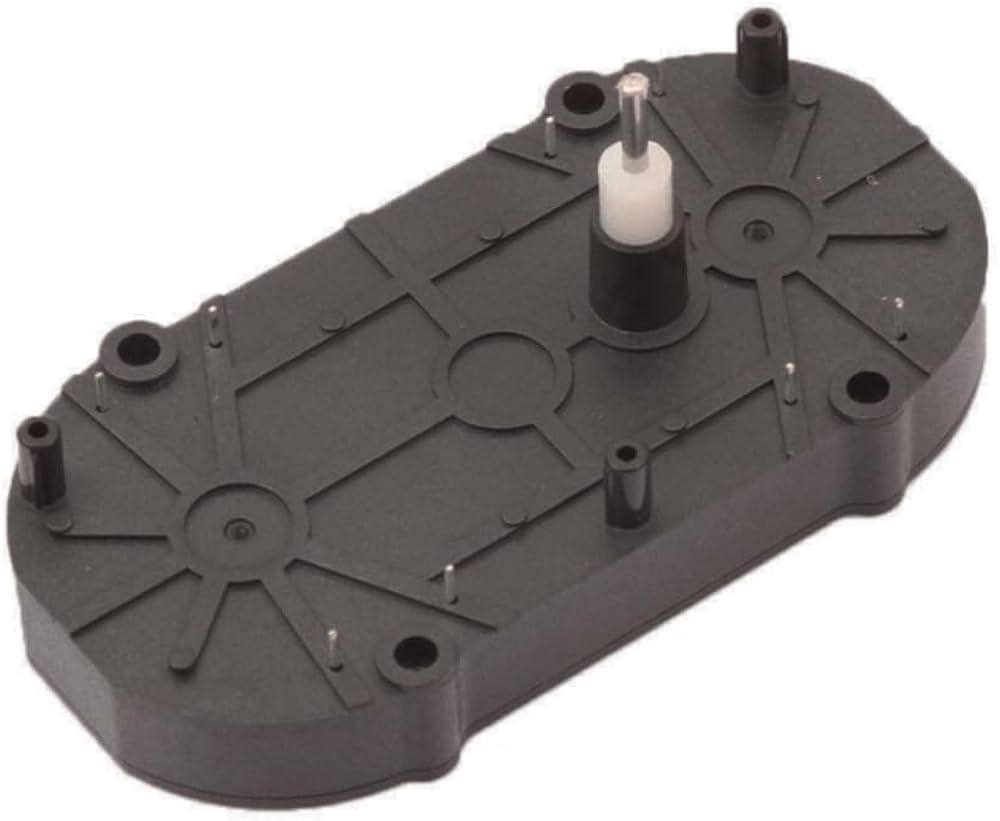
    <br><em>BKA30D-R5 stepper motor</em>
</p>

The BKA30D-R5 allows for microstepping up to 1/12 degrees per microstep, which is ideal to achieve smooth movement of the clock hands. See datasheet for more details: [BKA30D-R5 Datasheet](docs/datasheets/BKA30D-xx_datasheet.pdf).

*Note: As standard, this motor comes with mechanical endstops. On Aliexpress there are some vendors that sell it without endstops, otherwise you will need to cut off the endstops yourself.*

---

#### Motor Drivers
The steppers could in theory be driven directly from the microcontroller. However, the GPIO pins are limited and it is usually best practice to use a dedicated motor driver. For this reason, the VID6606 motor driver was chosen. It is specifically designed for the BKA30D-R5 (VID28-05) motor. One VID6606 can drive 4 motors (8 coils) in total. Per motor, it only needs two inputs: `f(SCX)` and `DIR`. As standard, this controller has built-in microstepping, which means with each rising edge of the SCX input the motor will perform one microstep in the direction specified by the DIR input.

The [VID6606 Datasheet](docs/datasheets/VID6606_datasheet.pdf) specifically recommends the use of smoothing capacitors to reduce electrical noise. Therefore, this [Motor-Controller-PCB from Hackaday](https://hackaday.io/project/187630-stepper-driver-for-dashpanel-instruments) was used. I didn't make any changes to it because it was already tested by [doctek](https://hackaday.io/doctek). Thus, it is designed to be used as a breakout board on the custom Clock PCB.

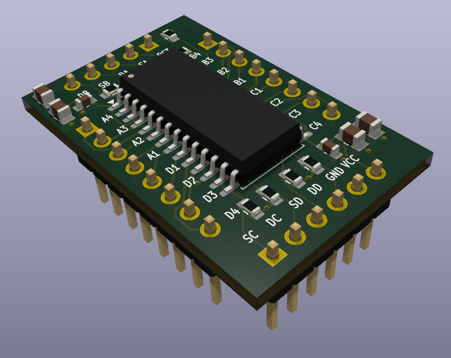
<p align="center"><em>Rendered image of the motor driver PCB</em></p>

During testing, the steppers were quite noisy. I first suspected the motor drivers and tried some alternatives (DRV8834, TMC2208), but that didn't help much, so I stayed with the VID6606. 

The real cause turned out to be mechanical play in the motor shafts. I also noticed the noise only appears at certain speeds, at full speed it mostly goes away. So adjusting the acceleration profile in software might help. For now I decided to leave the mechanical play as-is, since adding a bearing would be quite complex. I plan to experiment with the AccelStepper parameters (see [Software](#software)).

---

#### Microcontrollers
An ESP32 was chosen to run the master code, while multiple Raspberry Pi Picos are used as slave controllers. The ESP32 sends all the commands via I2C protocol to the slave boards. The main reason for this choice is that almost the same controllers were used in the reference project ([Vallasc/clockclock24-replica](https://github.com/Vallasc/clockclock24-replica)). Since I want to copy the software as closely as possible, I stuck with the same controllers. They are also widely available for a reasonable price and are easy to work with.

<p align="center">
    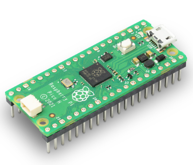
    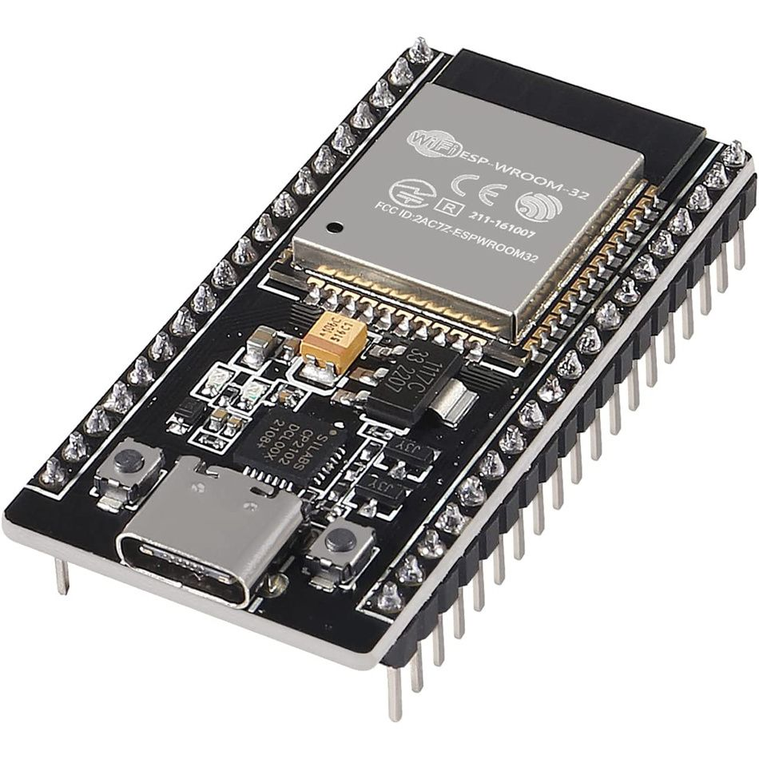
</p>
<p align="center"><em>Raspberry Pi Pico (left) and ESP32 (right)</em></p>

---

#### PCB
For the project, a custom Clock PCB was designed to hold three BKA30D-R5 motors, which is the maximum number of motors that can be driven by one Raspberry Pi Pico regarding available GPIO pins. In total, there are eight of these PCBs, resulting in an 8x3 matrix of 24 motors. Each Clock PCB has two VID6606 motor driver breakout boards, of which one output is unused.

As a design choice, the PCB uses header pins to connect the motor drivers and the microcontroller. This makes it easy to replace components in case they break. While testing, this happened multiple times. Since the motor controllers were directly soldered onto the PCB in the beginning, I ended up throwing away the whole PCB each time a motor driver broke. The header pins solve this problem. As a bonus, the Picos can be switched out easily. This proved useful to quickly run a test program by replacing the "normal" slave controller with a test controller running different firmware.

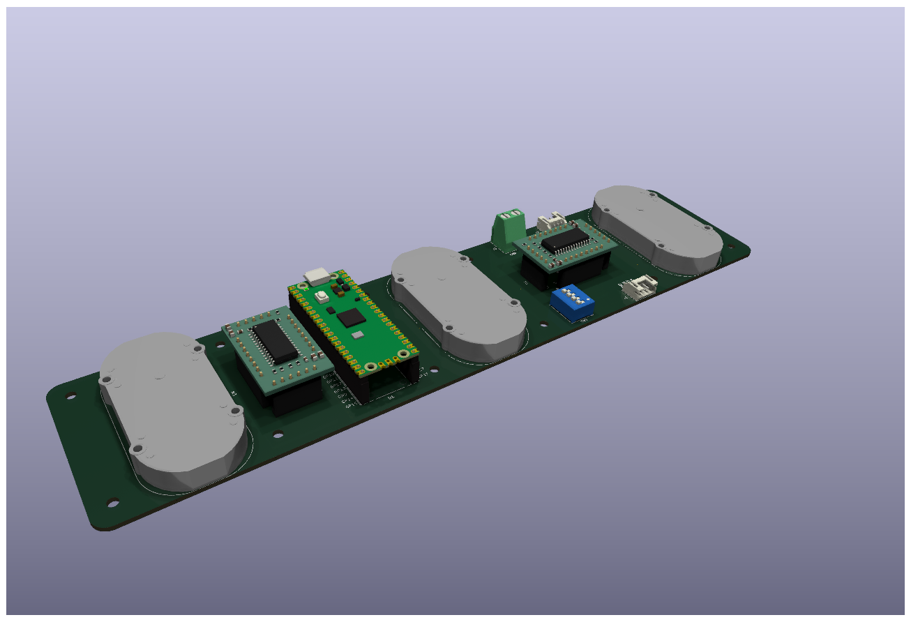
<p align="center"><em>Rendered image of the Clock PCB. See PCB directory for more info</em></p>


<p align="center"><em>Assembled Clock PCB</em></p>

---

#### Power Supply
All the PCBs are connected by a JST-XH 4-pin connector in a daisy chain. Two wires are used for power (5V and ground) and two wires are used for I2C communication (SDA and SCL). In theory, it should be possible to power all eight PCBs from one Raspberry Pi Pico connected to a power supply via USB-C. However, in reality this didnt work (see below).


#### Power Consumption Table

| Device                | Normal Current (mA) | Peak Current (mA) | Quantity | Total Normal (mA) | Total Peak (mA) |
|-----------------------|---------------------|-------------------|----------|-------------------|-----------------|
| Raspberry Pi Pico     | 50                  | 100               | 8        | 400               | 800             |
| Stepper Motor         | 20                  | 20                | 24       | 480               | 480             |
| ESP32                 | 260                 | 700               | 1        | 260               | 700             |
| **Total**             |                     |                   |          | **1140**          | **1980**        |

This table shows the estimated current draw for each device during normal use and at peak. The totals are for 8 Raspberry Pi Picos, 24 stepper motors, and 1 ESP32.

A Raspberry Pi Pico can provide up to 2 A via the VBUS pin when powered over USB-C, which should be enough even at peak load.

In practice I ran into power problems. When all motors start up at the same time, they draw a lot of current and the Pico's supply couldn't keep up, causing the ESP32 or some Picos to randomly shut down. To fix this, each PCB has an extra 2-pin JST power input. I disconnected the +5V lines on the JST-XH 4-pin connectors (GND and I2C stay connected) and wired the 2-pin terminals with 18 AWG wire and WAGO clamps to a separate supply.

The worst-case current draw is around 4 A, so I chose a 5 V / 6 A (30 W) PSU from [Amazon](https://www.amazon.de/dp/B0FY6691ZL), which gives a 2 A safety margin. It connects via a standard barrel jack that came with the PSU.


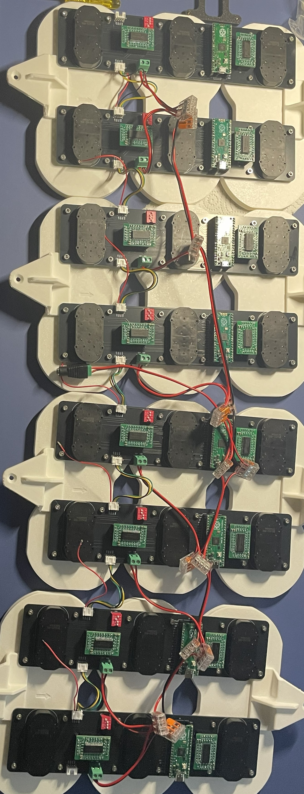
<p align="center"><em>Image of the connected PCBs</em></p>


### Mechanics

All mechanical parts are modeled in CAD. See the [3D files README](3D%20files/README.md) for the full assembly and a list of all printable parts.

#### Wooden Frame & Front panel

For the front panel I wanted a clean matte white look. After exploring several options (PVC, painted MDF, Corian), I found [expresszuschnitt.de](https://expresszuschnitt.de/) where you can order custom laser-cut materials. I ordered some samples and went with matte white acrylic (PERSPEX® Frost). The quality is excellent and the finish looks great. The front panel is bonded to the wooden frame with 3M VHB tape.

The frame itself is made from four wooden beams (see [BOM](#bom) for dimensions), connected at the corners by 3D-printed brackets that are screwed onto the beams.

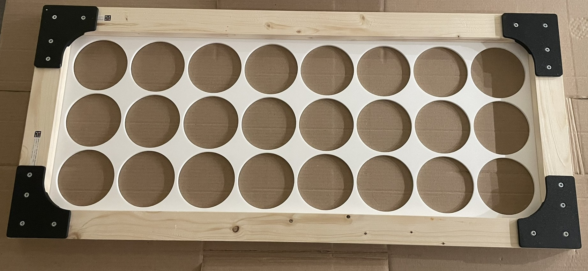
<p align="center"><em>Wooden frame with acrylic front panel</em></p>

To give the clock a picture-frame look, I added medium oak ledges glued onto the main frame with mitered corners. Cutting accurate miters with basic tools was tricky, but after some sanding and oiling the result looks quite nice.

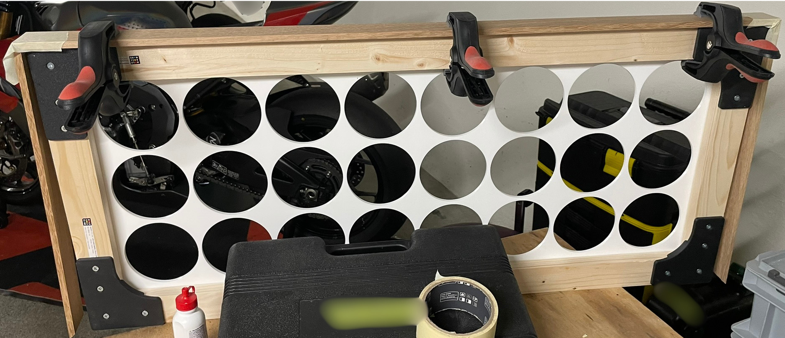
<p align="center"><em>Gluing the outer oak frame</em></p>

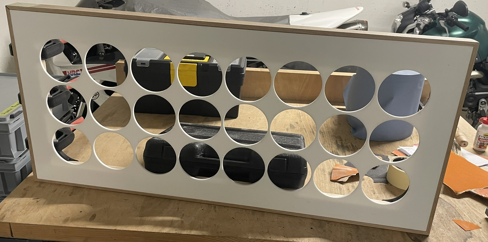
<p align="center"><em>Finished outer frame</em></p>


---

#### 2×3 Clock Arrays

The motors are grouped into 2×3 arrays. Each array consists of two PCBs connected by PCB mounts. Screw spacers raise the PCBs to the correct depth so the clock hands sit at the right position on the front. Everything is held together with M3 hex screws and threaded inserts.

<p align="center">
    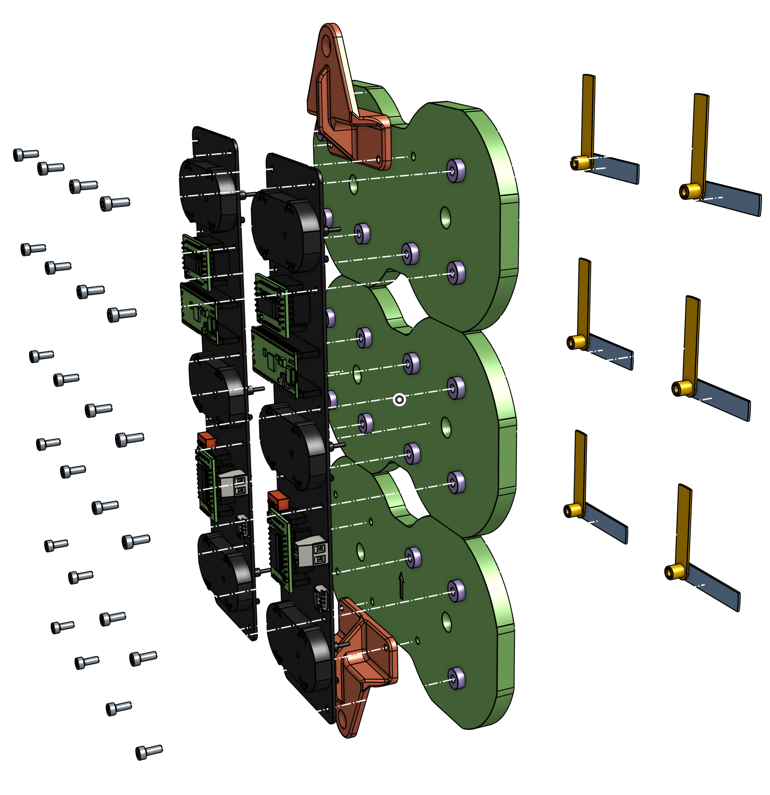
    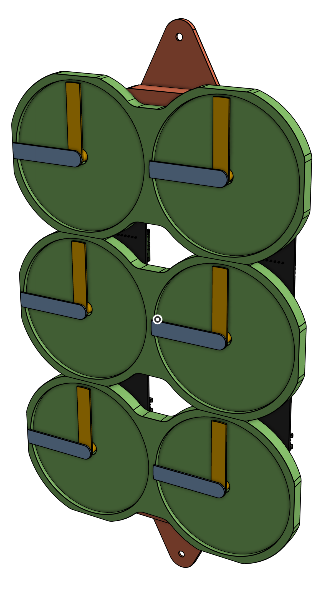
</p>
<p align="center"><em>Exploded view (left) and front view (right) of a 2×3 clock array</em></p>

The arrays are aligned with the holes in the front panel using the [`mounting_aid.stl`](3D%20files/README.md) and then screwed to the wooden frame. The PSU barrel jack is clamped to the bottom of the frame with a 3D-printed bracket. A small cutout in the outer frame lets the power cable pass through.

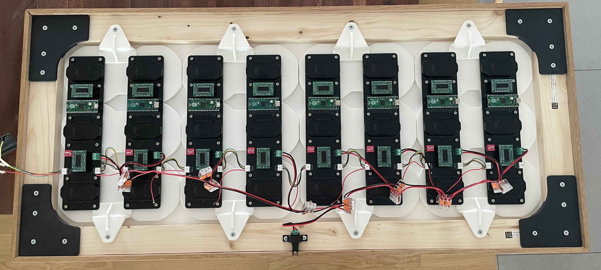
<p align="center"><em>Clock arrays mounted to the frame</em></p>

---
### BOM

| Component | Description | Quantity | Source | Link |
|-----------|-------------|----------|--------|------|
| Clock PCB | Custom PCB holding 3 motors and a Raspberry Pi Pico. See PCB directory for the electronic BOM | 8 | JLCPCB, parts from AliExpress | [PCB README](pcb/Clock%20PCB/README.md) |
| PCB Mount (3D printed) | Mounts two PCBs together into one 2×3 array. 3 pieces per array | 9 | Self-printed | [3D files README](3D%20files/README.md) |
| PCB Mount Bottom (3D printed) | Same as PCB Mount but with corrected hole positions for the bottom PCB | 3 | Self-printed | [3D files README](3D%20files/README.md) |
| Mounting Bracket (3D printed) | Connects a 2×3 clock array to the wooden frame | 6 | Self-printed | [3D files README](3D%20files/README.md) |
| PSU Bracket (3D printed) | Clamps the PSU barrel jack to the wooden frame | 1 | Self-printed | [3D files README](3D%20files/README.md) |
| Frame Connector (3D printed) | Connects the outer frame corners. Parts are mirrored for each corner | 4 | Self-printed | [3D files README](3D%20files/README.md) |
| Screw Spacer (3D printed) | Raises PCBs slightly off the mounting brackets | 80 | Self-printed | [3D files README](3D%20files/README.md) |
| Lower Hand (3D printed) | Hour clock hand | 24 | Self-printed | [3D files README](3D%20files/README.md) |
| Upper Hand (3D printed) | Minute clock hand | 24 | Self-printed | [3D files README](3D%20files/README.md) |
| Acrylic Front Panel | PERSPEX® Frost matte white acrylic, 900×400×5 mm | 1 | Imported from Germany | [expresszuschnitt.de](https://expresszuschnitt.de/) |
| Main Frame Long | 20×45×900 mm wood beam | 2 | Hardware store | [Jumbo](https://www.jumbo.ch/de/bauen-renovieren/holz/leisten-staebe/rechteckleisten/oecoplan-dachlatte-gehobelt-20-x-45mm--1m/p/4974449) |
| Main Frame Short | 20×45×400 mm wood beam | 2 | Hardware store | [Jumbo](https://www.jumbo.ch/de/bauen-renovieren/holz/leisten-staebe/rechteckleisten/oecoplan-dachlatte-gehobelt-20-x-45mm--1m/p/4974449) |
| Outer Frame Long | 8×40×920 mm oak ledge | 2 | Hardware store | [Jumbo](https://www.jumbo.ch/de/bauen-renovieren/holz/leisten-staebe/rechteckleisten/rechteckleiste-eiche-8x40-mm-1-m/p/4974225) |
| Outer Frame Short | 8×40×420 mm oak ledge | 2 | Hardware store | [Jumbo](https://www.jumbo.ch/de/bauen-renovieren/holz/leisten-staebe/rechteckleisten/rechteckleiste-eiche-8x40-mm-1-m/p/4974225) |
| Power Supply | 5 V / 6 A (30 W) PSU | 1 | Amazon | [Amazon](https://www.amazon.de/dp/B0FY6691ZL) |
| Power Wire | 18 AWG | ~3 m | AliExpress | |
| WAGO Clamps | Model 221-413 (3-conductor) | 14 | AliExpress | |
| 3M VHB Tape | 19 mm width | ~1 m | Hardware store | [3M Switzerland](https://www.3mschweiz.ch/3M/de_CH/p/c/klebebander/b/vhb/) |
| Countersunk Wood Screw | 4×16 mm | 24 | Hardware store | [Jumbo](https://www.jumbo.ch/de/maschinen-werkstatt/kleineisenwaren/schrauben/holzschrauben/ayce-senkkopf-universalholzschraube--4--16-mm/p/6932501) |
| Hex Screw | M3×8 mm | 96 | AliExpress | |
| Threaded Insert | M3×4×4 mm (for 3D-printed parts) | 96 | AliExpress | |


---

## Software

### Master

The master firmware runs on an ESP32 microcontroller and serves as the central brain of the clock system. Its primary responsibilities include:

- **Time Synchronization**: Connects to WiFi and retrieves the current time via NTP (Network Time Protocol), automatically handling time zones and daylight saving time adjustments
- **I2C Communication**: Acts as the I2C master, sending synchronized commands to all eight slave boards to coordinate motor movements
- **Web Server**: Hosts a responsive web interface accessible via the ESP32's IP address, allowing users to control the clock remotely
- **Clock Logic**: Orchestrates the display logic, calculating which motor positions are needed to form digits and managing transitions between different display modes

The master code is built using PlatformIO with the Arduino framework and can be configured for different WiFi networks and time zones.

### Slave

The slave firmware runs on each of the eight Raspberry Pi Pico microcontrollers, with each board responsible for controlling three BKA30D-R5 stepper motors (six individual clock hands). Key features include:

- **I2C Communication**: Listens for commands from the ESP32 master via I2C protocol
- **Motor Control**: Uses the AccelStepper library to provide smooth, accelerated motor movements with precise positioning
- **Automatic Addressing**: Determines its I2C address automatically based on DIP switch configuration (see below)
- **Calibration**: Supports motor homing sequences to establish reference positions for accurate timekeeping

Each slave board operates independently once it receives position commands from the master, managing the acceleration profiles and step timing for its three motors in parallel.

Each slave board (Raspberry Pi Pico) determines its I2C address automatically based on four DIP switch pins (ADDR_1 through ADDR_4) defined in [`board_config.h`](firmware/platformio/slave/include/board_config.h). The address is calculated in [`board.cpp`](firmware/platformio/slave/src/board.cpp) by reading the state of these pins, which use INPUT_PULLUP logic. When a DIP switch is ON (connected to ground), it represents a binary 1; when OFF (open/floating), it represents a binary 0.

The master controller sends commands to each board sequentially using the formula `index + 1` as seen in [`clock_manger.cpp`](firmware/platformio/master/src/clock_manger.cpp), where index 0 corresponds to I2C address 1 (the leftmost board).

#### Board Address Configuration (Left to Right)

| I2C Address | Binary | DIP 1 | DIP 2 | DIP 3 | DIP 4|
|-------------------|-------------|--------|----------------|--------------|--------------|
| 1 | 0001 | 0 | 0 | 0 | 1 |
| 2 | 0010 | 0 | 0 | 1 | 0 |
| 3 | 0011 | 0 | 0 | 1 | 1 |
| 4 | 0100 | 0 | 1 | 0 | 0 |
| 5 | 0101 | 0 | 1 | 0 | 1 |
| 6 | 0110 | 0 | 1 | 1 | 0 |
| 7 | 0111 | 0 | 1 | 1 | 1 |
| 8 | 1000 | 1 | 0 | 0 | 0 |

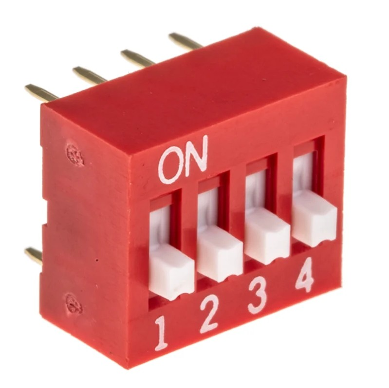

**Note:** The I2C address is calculated as `1 + binary value`. Each DIP switch state represents: **1** = switch ON (connected to GND), **0** = switch OFF (open/floating). The physical 4-position DIP switch is mounted in reverse order: physical DIP 1 (leftmost) is unused, physical DIP 2 corresponds to `DIP_SW_3` in the code (MSB, weight=4), physical DIP 3 to `DIP_SW_2` (weight=2), and physical DIP 4 (rightmost) to `DIP_SW_1` (LSB, weight=1).


### Web Interface

The web interface provides an intuitive control panel for the ClockClock 24, built using HTML, CSS, and JavaScript. It offers the following features:

- **Real-Time Clock Control**: Display the current time with smooth transitions between minutes
- **WiFi Configuration**: Configure network credentials and connection settings directly through the web UI
- **Display Modes**: Switch between different modes including time display, custom patterns, animations, and demo sequences
- **Manual Control**: Ability to manually position individual clock hands for testing and calibration purposes
- **System Status**: View connection status, current time, and system information

To access the web interface, connect to the same WiFi network as the ESP32 and navigate to its IP address in any web browser. The interface is responsive and works on both desktop and mobile devices.

For detailed build and upload instructions, see the [firmware README](firmware/README.md).

---

## How to get started

---

## Credits

