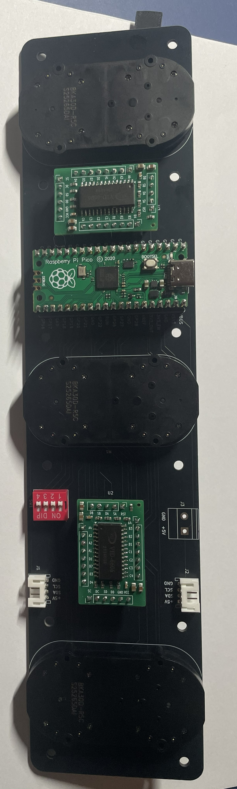
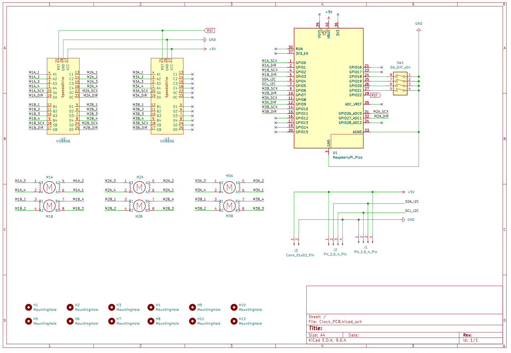

# Clock PCB — Main Board for ClockClock 24 Replica

This folder contains the design files, manufacturing resources, and assembly instructions for the Clock PCB used in the ClockClock 24 Replica project. The Clock PCB hosts three stepper motors, a Raspberry Pi Pico microcontroller, and connectors for two Motor Driver modules.

---

## Folder Contents

- **KiCad Design Files:** Schematic and layout for the Clock PCB.
- **Manufacturing Folder:**
  - Gerber files (ZIP) for PCB fabrication

---

## Manufacturing

1. **PCB Fabrication:**
   - Order the PCB from [JLCPCB](https://jlcpcb.com/) or a similar service.
   - Upload the Gerber ZIP file from the `Manufacturing` folder during the order process.

3. **Manual Assembly:**
    - Solder all the components manually

---

## Bill of Materials (BOM)

This BOM lists only the components that need to be soldered onto the Clock PCB. The full BOM for the final assembly is provided in [the main project README](../../README.md).

| Quantity | Reference      | Value                 | Footprint | Description               |
|----------|----------------|-----------------------|-----------|---------------------------|
| 3        | M1, M2, M3     | BKA30D-R5             | -         | Stepper Motor             |
| 2        | J1, J2         | JST-PH-4pin           | P2.0mm    | 4-pin JST PH, 90° angle   |
| 2        | -              | 20 pin female         | P2.54mm   |  20 Pin socket            |
| 2        | -              | 6 pin female header   | P2.54mm   | 6 Pin socket              |
| 1        | -              | 5 pin female header   | P2.54mm   | 5 Pin socket              |
| 1        | -              | 8 pin female header   | P2.54mm   | 8Pin socket               |
| 1        | SW1            | 4 bit                 | P2.54mm   | 4-bit DIP switch          |
| 1        | J3 (optional)  | Power connector       | P5.08mm   | Optional power connector  |

---

## Images

### Assembled Clock PCB Example

  
   <em>Assembled Clock PCB</em>

### PCB Schematics

  
   <em>Clock PCB Schematic</em>

