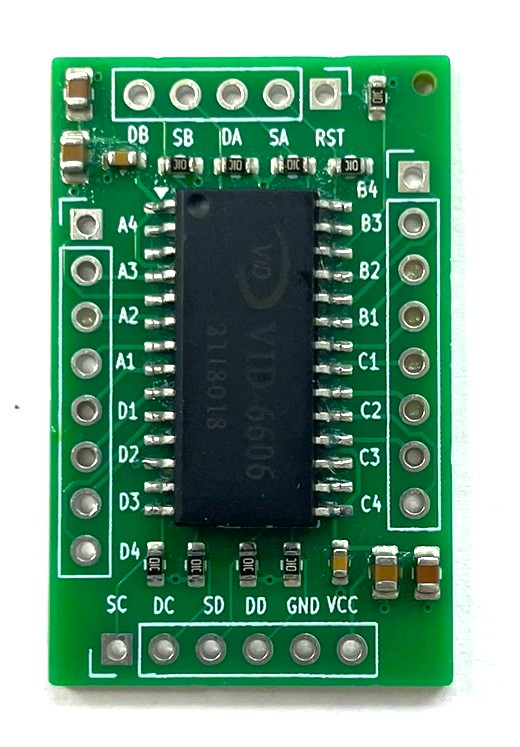
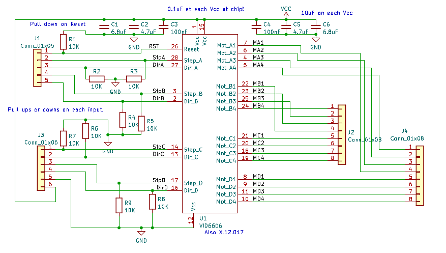
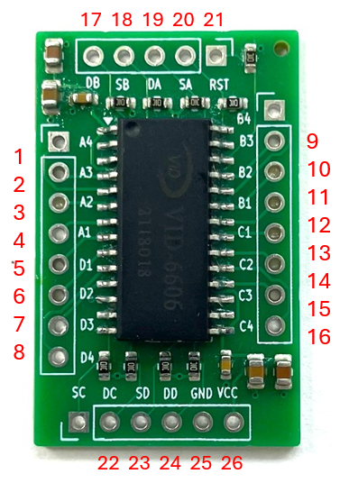

# Motor Driver PCB

This folder contains the design files and manufacturing resources for the KiCad project. Below is an overview of the contents and instructions for using these files.

## Contents
- **KiCad Design Files**: The schematic and layout files for the PCB.
- **Manufacturing Folder**: Contains the necessary files for PCB fabrication and assembly, including:
  - Gerber files (in a ZIP file) for PCB manufacturing.
  - A CSV file with the positions and part names of the SMD components for assembly.

## Manufacturing Instructions

1. **PCB Fabrication**:
   - The PCB was ordered from [JLCPCB](https://jlcpcb.com/), including the assembly of SMD components.
   - To order the PCB, upload the ZIP file from the `Manufacturing` folder to JLCPCB.

2. **SMD Assembly**:
   - During the order process, you will be prompted to provide a Bill of Materials (BOM) file for SMD assembly.
   - Use the CSV file in the `Manufacturing` folder for this purpose.

### Soldered PCB
  

### PCB Schematics
  

### Mechanical Pin Numbers
Below is an illustration of the mechanical pin numbers for the Speedo Drive PCB. This image helps identify the physical pin layout and connections for assembly and troubleshooting. The pin numbering shown here was used to design the KiCad footprint for this board.

